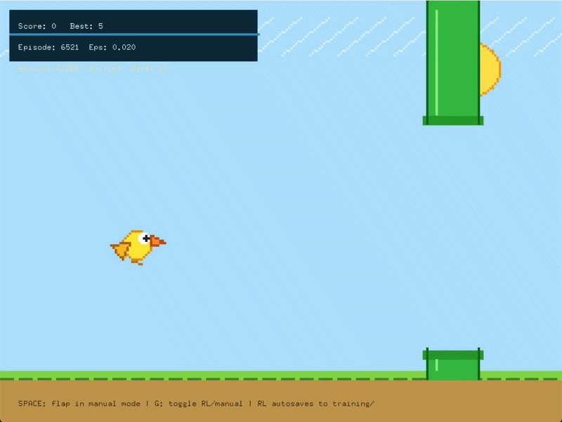

# 🐦 Reinforcement Learning Flappy Bird

A Flappy Bird clone where an AI learns to play autonomously using **Q-Learning Reinforcement Learning**. The project features continuous self-training, persistent learning through saved Q-Tables, adjustable training speed, manual play mode, and a complete OpenGL implementation using classic computer graphics algorithms.

---

## 📸 Demo

<p align="center">
  
</p>

> _(Replace `demo.gif` with your gameplay recording.)_

---

# Features

- 🧠 Q-Learning Reinforcement Learning agent
- 🎮 Manual mode for human gameplay
- 🤖 Automatic AI training through continuous self-play
- 💾 Persistent Q-Table saving and loading
- 📈 Episode statistics logging
- ⚡ Adjustable training speed
- 📊 Automatic checkpoint saving
- 🌍 Dynamic difficulty progression
- 🐦 Custom animated bird
- 🌳 Procedurally generated pipes
- 🎨 Built entirely with OpenGL and GLUT
- 📐 Uses classic computer graphics algorithms for rendering

---

# Reinforcement Learning

The AI learns through **Q-Learning**, gradually improving its performance over thousands of episodes.

### State Representation

The environment state is represented using:

- Bird vertical position relative to the next pipe
- Bird vertical velocity
- Horizontal distance to the next pipe

The continuous state space is discretized into bins to create a finite Q-Table.

### Actions

The agent has only two possible actions:

- Stay (Do Nothing)
- Flap

### Reward Function

The reward system encourages survival while discouraging collisions.

Positive rewards:

- Staying alive
- Passing a pipe
- Remaining close to the center of the pipe gap

Negative rewards:

- Colliding with pipes
- Hitting the ground
- Flying outside the game area

---

# Training

Training occurs continuously while the program is running.

After every episode:

- The Q-Table is updated
- Episode statistics are recorded
- Exploration rate (ε) gradually decreases
- Progress is automatically saved

Training data is stored inside:

```
training/
├── qtable.csv
├── stats.txt
└── episode_log.csv
```

This allows the AI to continue learning even after restarting the program.

---

# Controls

| Key       | Function                |
| --------- | ----------------------- |
| **G**     | Toggle AI / Manual Mode |
| **Space** | Flap (Manual Mode)      |
| **+**     | Increase training speed |
| **-**     | Decrease training speed |
| **R**     | Reset all training data |
| **ESC**   | Save and Exit           |

---

# Computer Graphics Techniques

This project demonstrates several fundamental graphics algorithms including:

- Bresenham Line Drawing Algorithm
- DDA Line Drawing Algorithm
- Midpoint Circle Algorithm
- Triangle Rasterization
- Polygon Rendering
- 2D Transformation Matrices
- Translation
- Rotation
- Scaling

Everything is rendered manually using OpenGL primitives.

---

# Dynamic Difficulty

The game becomes progressively harder as the AI survives longer.

Difficulty increases by:

- Faster pipe movement
- Smaller pipe gaps
- Reduced spacing between pipes

This provides a more challenging environment for continual reinforcement learning.

---

# Project Structure

```
.
├── main.cpp
├── training/
│   ├── qtable.csv
│   ├── stats.txt
│   └── episode_log.csv
├── demo.gif
└── README.md
```

---

# Technologies Used

- C++
- OpenGL
- GLUT (FreeGLUT)
- Reinforcement Learning
- Q-Learning
- Computer Graphics
- STL

---

# Learning Progress

As training progresses, the AI gradually:

- Learns when to flap
- Avoids collisions
- Survives longer
- Achieves higher scores
- Requires less exploration due to decreasing ε

The learning process is entirely autonomous.

---

# Future Improvements

- Deep Q-Network (DQN)
- Double DQN
- Prioritized Experience Replay
- Neural Network function approximation
- TensorBoard visualization
- Multiple AI agents
- Genetic Algorithm comparison
- PPO implementation
- Real-time training graphs

---

# Installation

## Requirements

- C++17
- OpenGL
- GLUT / FreeGLUT

---

## Build

Compile using your preferred compiler.

Example (g++):

```bash
g++ main.cpp -o FlappyBirdRL -lglut -lGL -lGLU
```

Windows (MinGW):

```bash
g++ main.cpp -o FlappyBirdRL.exe -lfreeglut -lopengl32 -lglu32
```

---

# Running

Simply execute the compiled application.

The AI will immediately begin training from the existing Q-Table if one is available.

Otherwise, it will start learning from scratch.

---

# Educational Purpose

This project was created to demonstrate the integration of:

- Reinforcement Learning
- Game AI
- Computer Graphics
- OpenGL Programming
- Autonomous Agent Training

into a single interactive application.

# Author

**Arhab Jahin**

_email: arhabjahin.b@gmail.com_

---

## ⭐ If you find this project interesting, consider starring the repository.
